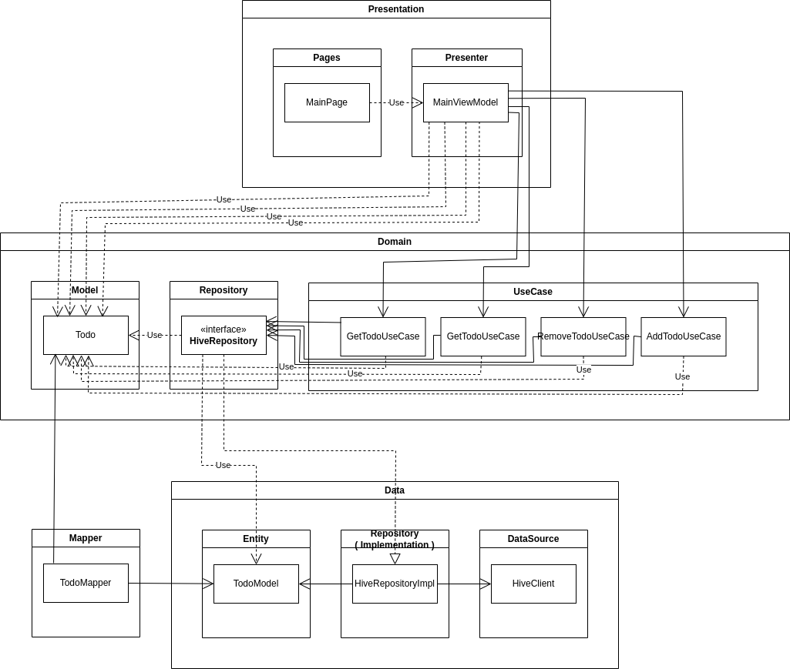

# 프로젝트 요약

Todo-Application(가칭)은 사용자가 할 일을 목록에 추가하고, 완료된 일을 체크하는 기능을 가진 어플리케이션입니다.

# 프로젝트 준비

프로젝트를 받은 후 아래의 커맨드를 입력해주세요.

```bash
$ flutter pub get
$ flutter pub run build_runner build
```

# 프로젝트 개요

- 사용 언어 및 프레임워크
    - Dart : >=3.1.4 <4.0.0
    - Flutter : >=3.10.0
- 아키텍쳐 패턴
    - Clean Architecture
- 사용한 대표적인 패키지
    - go_router
    - hive_flutter
    - flutter_riverpod

# 프로젝트 구조

### 폴더 구조

```bash
- /lib
	- /src
		- /core
			- /contants
				- todo_hive_keys.dart # hive key 상수
			- /routes
				- app_pages.dart # 라우트 관리
				- app_routes.dart # 라우트 이름
		- /features
			- /main
				- /data
					- /data_sources
						- hive_client.dart # Hive와 상호작용
					- /mapper
						- todo_mapper.dart # Model <=> Entity
					- /models
						- todo_model.dart # Todo 엔티디
					- /repositories
						- hive_repository_impl.dart # Hive Repo의 구현체
				- /domain
					- /entities
						- todo.dart # UI에서 사용될 Todo 모델
						- todo_status.dart # Todo의 상태 ( 아무것도 아님, 완료, 미완료 )
					- /repositories
						- hive_repository.dart # Hive 클라이언트와 상호작용하는 비지니스 로직의 인터페이스
					- /usecases
						- hive_usecases.dart # 서비스 기능을 최소 단위로 분리해놓은 usecase를 관리하는 저장소
				- /presentation
					- /pages
						- /main_pages # 메인 페이지 UI
					- /presenter
						- /main
							- state.dart # 메인 페이지의 state
							- viewmodel.dart # 메인 페이지 viewmodel
						- providers.dart # viewmodel의 provider 저장소
```

### 계층 구조



# 프로젝트 기능

### 목표 관리

- 목표를 추가하면 Todo 리스트에 추가됨과 동시에 오늘의 목표의 개수가 증가된다.
- 완료된 목표는 7일 후 자동으로 삭제되며, 오늘의 목표에서 제외가 된다.

<div align="center">
    
    
</div>

### 목표 상태 관리

- 완료된 목표는 하루가 지날 때 마다 삭제 까지 남은 일수를 갱신한다.
- 등록된 날짜로 부터 하루가 지난 목표가 있을 경우
    - 등록된 날짜로 부터 지난 일수를 표시한다.
    - 미달성 목표에 카운팅되며, 오늘의 목표에는 제외된다.
    
<div align="center">
    
</div>

